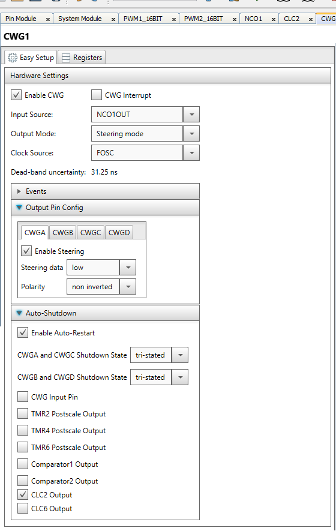

# Objective:
The “pic18f57q43-dma-hzvideo” project highlights the use of the PIC18F57Q43 family’s new PWM and DMA peripherals to create a statemachine which generates horizontal video timing. PWM1 generates the horizontal sync pulse and gates the color burst output using CLC2 and the CWG's auto-shutdown feature.  PWM2 generates a display enable signal with the appropriate blanking before and after the horizontal sync and color burst. The 3.57MHz signal is generates by the NCO is this application, however this is only for demonstration, in an actual video timing generator an external 3.579545 MHz oscillator should be used. The project can also generate vertical sync pulses by triggering DMA1, triggering DMA2 will return the horizontal sync timing

# Demo Configuration:
The Curiosity Nano Adapter Board (DM164150) is used in conjunction with the Curiosity Nano Base for Click Boards (AC164162) as the development platform. The Nano Base board has three MikroElektronika Click board slots, several types of power connections, voltage regulation circuitry, and a header mount for the Nano Development board. For this project the Nano Base board only supplies connectivity and power. No click boards are used in this project.


### Curiosity Nano Development Board and Nano Base Board:


### Complete Project Setup:


# Project Software Configuration:
The project software was developed in MPLAB X with the help of the MPLAB Code Configurator (MCC) plug-in tool. The MCC tool provides a user-friendly interface that generates software based on the user’s parameters. MCC allows developers who may not be familiar with a new peripheral a way to quickly set up and test a peripheral without having to dive deep into the device datasheet. For this project, the MCC tool was used to generate code for the PWM, CLC, and CWG modules.  

Note: the DMA was configured in code for clarity.  

The output of the generator are available on port the following port pings.

Horizontal sync pulse     RC0
Gated color burst         RB0
Video enable              RB1

## PWM1 Configuration:
The PWM1 module was configured such that phase 1 generates a 5us (8%) left aligned pulse with a 63us period (15,750kHz) for standard US video.  Phase 2 generates a 8us pulse (11%), which when XORed with phase 1 creates a 3uS enable pulse on the 'Back Porch' of the horizontal sync pulse.
Note: The PWM is not enabled initially, this is so both PWMs can have a synchronized start.

### MCC PWM1 Editor Window:


```c
void PWM1_16BIT_Initialize(void)
{  
    PWM1ERS = 0x00;  //PWMERS External Reset Disabled;
    PWM1CLK = 0x0A;    //PWMCLK NCO1OUT;
    PWM1LDS = 0x00;    //PWMLDS Autoload disabled;
    PWM1PRL = 0xE1;    //PWMPRL 225;
    PWM1PRH = 0x00;    //PWMPRH 0;
    PWM1CPRE = 0x00;    //PWMCPRE No prescale;
    PWM1PIPOS = 0x00;    //PWMPIPOS No postscale;
    //PWMS1P2IF PWM2 output match did not occur; PWMS1P1IF PWM1 output match did not occur;
    PWM1GIR = 0x00;
    PWM1GIE = 0x00;    //PWMS1P2IE disabled; PWMS1P1IE disabled;
    //PWMPOL2 disabled; PWMPOL1 disabled; PWMPPEN disabled; PWMMODE Left aligned mode;
    PWM1S1CFG = 0x00;
    PWM1S1P1L = 0x12;    //PWMS1P1L 18;
    PWM1S1P1H = 0x00;    //PWMS1P1H 0;
    PWM1S1P2L = 0x18;    //PWMS1P2L 24;
    PWM1S1P2H = 0x00;    //PWMS1P2H 0;
    //PWMEN disabled; PWMLD disabled; PWMERSPOL disabled; PWMERSNOW disabled;
    PWM1CON = 0x00;
}
```
## PWM2 Configuration:
The PWM2 module was configured such that phase 1 generates a 43us variably aligned pulse 10 us following the horizontal pulse with a 63us period (15,750kHz) for standard US video. Phase 2 is used to generate the variable alignment. This configuration generates a video enable signal that ends 5us before the horizontal pulse and 7us after the color burst.
phase 1 is 17%
phase 2 is 92%
Note: The PWM is not enabled initially, this is so both PWMs can have a synchronized start.

### MCC PWM2 Editor Window:


```c
void PWM2_16BIT_Initialize(void)
{
    PWM2ERS = 0x00;    //PWMERS External Reset Disabled;
    PWM2CLK = 0x0A;    //PWMCLK NCO1OUT
    PWM2LDS = 0x00;    //PWMLDS Autoload disabled;
    PWM2PRL = 0xE1;    //PWMPRL 225;
    PWM2PRH = 0x00;    //PWMPRH 0;
    PWM2CPRE = 0x00;    //PWMCPRE No prescale;
    PWM2PIPOS = 0x00;    //PWMPIPOS No postscale;
    //PWMS1P2IF PWM2 output match did not occur; PWMS1P1IF PWM1 output match did not occur;
    PWM2GIR = 0x00;
    PWM2GIE = 0x00;    //PWMS1P2IE disabled; PWMS1P1IE disabled;
    //PWMPOL2 disabled; PWMPOL1 disabled; PWMPPEN disabled; PWMMODE Variable aligned mode;
    PWM2S1CFG = 0x03;
    PWM2S1P1L = 0x26;    //PWMS1P1L 38;
    PWM2S1P1H = 0x00;    //PWMS1P1H 0;
    PWM2S1P2L = 0xCF;    //PWMS1P2L 207;
    PWM2S1P2H = 0x00;    //PWMS1P2H 0;
    //PWMEN disabled; PWMLD disabled; PWMERSPOL disabled; PWMERSNOW disabled;
    PWM2CON = 0x00;
}

```
## CLC2 Configuration:
The CLC2 module was configured to provide an exclusive OR function for combining Phase 1 and Phase 2 of PWM1.  The output of CLC1 drives the auto-shutdown of the CWG. This gates the color burst output.

### MCC CLC2 Editor Window:


```c
void CLC2_Initialize(void)
{
    // Set the CLC2 to the options selected in the User Interface
    // SLCT 1;
    CLCSELECT = 0x01;
    // G1POL not_inverted; G2POL not_inverted; G3POL not_inverted; G4POL not_inverted; POL not_inverted;
    CLCnPOL = 0x00;
    // D1S PWM1_OUT1;
    CLCnSEL0 = 0x22;
    // D2S CLCIN0 (CLCIN0PPS);
    CLCnSEL1 = 0x00;
    // D3S PWM1_OUT2;
    CLCnSEL2 = 0x23;
    // D4S CLCIN0 (CLCIN0PPS);
    CLCnSEL3 = 0x00;
    // G1D3N disabled; G1D2N disabled; G1D4N disabled; G1D1T enabled; G1D3T disabled; G1D2T disabled; G1D4T disabled; G1D1N disabled;
    CLCnGLS0 = 0x02;
    // G2D2N disabled; G2D1N disabled; G2D4N disabled; G2D3N disabled; G2D2T disabled; G2D1T disabled; G2D4T disabled; G2D3T disabled;
    CLCnGLS1 = 0x00;
    // G3D1N disabled; G3D2N disabled; G3D3N disabled; G3D4N disabled; G3D1T disabled; G3D2T disabled; G3D3T enabled; G3D4T disabled;
    CLCnGLS2 = 0x20;
    // G4D1N disabled; G4D2N disabled; G4D3N disabled; G4D4N disabled; G4D1T disabled; G4D2T disabled; G4D3T disabled; G4D4N disabled;
    CLCnGLS3 = 0x00;
    // CLC2OUT 0;
    CLCDATA = 0x00;
    // EN enabled; INTN disabled; INTP disabled; MODE OR-XOR;
    CLCnCON = 0x81;
}

```

## CWG Configuration:
The CWG peripheral is used to gate the raw 3.57MHz signal with the gating signal generated by the CLC2. The input of the CWG is connected to the 3.57 MHz signal from the NCO and the CLC2 output is connected to the auto-shutdown of the CWG.

### MCC CWG Editor Window:

```c
void CWG1_Initialize(void)
{
  // Set the CWG1 to the options selected in PIC10 / PIC12 / PIC16 / PIC18 MCUs
	// CWG1POLA non inverted; CWG1POLC non inverted; CWG1POLB non inverted; CWG1POLD non inverted;
	CWG1CON1 = 0x00;
	// CWG1DBR 0;
	CWG1DBR = 0x00;
	// CWG1DBF 0;
	CWG1DBF = 0x00;
	// SHUTDOWN No Auto-shutdown; REN enabled; CWG1LSDB tri-stated; CWG1LSAC tri-stated;
	CWG1AS0 = 0x54;
	// AS1E disabled; AS0E disabled; AS3E disabled; AS2E disabled; AS5E disabled; AS4E disabled; AS7E disabled; AS6E enabled;
	CWG1AS1 = 0x40;
	// CWG1CS FOSC;
	CWG1CLKCON = 0x00;
	// CWG1STRD disabled; CWG1STRB disabled; CWG1STRC disabled; CWG1STRA enabled; CWG1OVRD low; CWG1OVRA low; CWG1OVRB low; CWG1OVRC low;
	CWG1STR = 0x01;
	// CWG1ISM NCO1OUT;
	CWG1ISM = 0x0C;
	// CWG1LD Buffer_not_loaded; CWG1EN enabled; CWG1MODE Steering mode;
	CWG1CON0 = 0x80;
}
```
## DMA1 and DMA2 Configuration:
The DMA1 and 2 peripherals are used to reconfigure the PWM1 and PWM2 for horizontal or vertical pulse generation. The peripherals are configured by this code, but they are not triggered as there is not vertical timing chain implemented. The necessary tables for reconfiguring the PWM are included.  To use the code, it will be necessary to configure the two DMA with appropriate trigger settings.

Note: the mirror registers in page 64 are used because it contains a continuous register set, without unused or reserved register locations.  

```c
void	DMA_Setup(void)
{
    DMASELECT = 0;              //select DMA1
    DMAnSSA   = &Vert[0];       //set source start address to Vertical pulse constants
    DMAnDSA   = 0x4020;         //set destination start address to start of PWM registers
    DMAnCON1  = 0x42;           //set control register1
    DMAnSSZ   = 12;             //set source size
    DMAnDSZ   = 12;             //set destination size
    DMAnSIRQ  = ****;           //set DMA Transfer Trigger Source (start of vertical)
    DMAnAIRQ  = 0x01;           //set DMA Transfer abort Source
    DMAnCON0  = 0xC0;           //set control register0

    DMASELECT = 1;              //select DMA2
    DMAnSSA   = &Horz[0];  		//set source start address to Horizonal pulse constants
    DMAnDSA   = 0x4020;         //set destination start address to start of PWM registers
    DMAnCON1  = 0x42;           //set control register1
    DMAnSSZ   = 12;             //set source size
    DMAnDSZ   = 12;             //set destination size
    DMAnSIRQ  = ****;           //set DMA Transfer Trigger Source (start of Horizontal)
    DMAnAIRQ  = 0x01;           //set DMA Transfer abort Source
    DMAnCON0  = 0xC0;           //set control register0

	asm ("BANKSEL PRLOCK");     //unlock arbiter to set dma priority
    asm ("MOVLW 0x55");
    asm ("MOVWF PRLOCK");
    asm ("MOVLW 0xAA");
    asm ("MOVWF PRLOCK");
    asm ("BSF PRLOCK, 0");
	DMA1PR	=	0;			    //set DMA1 to highest priority
	DMA2PR  =   1;			    //set DMA2 to next highest priority
}

```

## Horizontal and Vertical configuration arrays:
The data table for storage of the PWM configuration for horizontal and vertical pulse generation.

```c
#include "mcc_generated_files/mcc.h"
/*
                      PWM reprogramming table
                      {PWM1P1L, PWM1P1H, PWM1P2L, PWM1P2H, PWM1PRL, PWM1PRH,
                       PWM2P1L, PWM2P1H, PWM2P2L, PWM2P2H, PWM2PRL, PWM2PRH}
*/
uint8_t Vert[] =      {0x71, 0x00, 0x71, 0x00, 0x70, 0x00,
                       0x61, 0x00, 0x61, 0x00, 0x70, 0x00};

uint8_t Horz[] =      {0x12, 0x00, 0x18, 0x00, 0xE1, 0x00,
					   0x26, 0x00, 0xCF, 0x00, 0xE1, 0x00};;
```

## main loop:
The main program is does not actually do anything other than configuration the peripherals and perform a synchronized start for PWM1 and PWM2.

```c
void main(void)
{
    SYSTEM_Initialize();
	DMA_Setup();
    PWMEN = 0x0F;

    while (1)
    {
        // Add your application code
    }
}

```
## System Configuration:
MCC can be used to configure basic system parameters, such as oscillator selection and I/O pin configuration.
Once all project parameters have been configured, simply press the ‘Generate’ button, and MCC will generate the drivers based on user inputs.
Note: because the ADCC is configured using the config/data array and the two DMA channels, there is no MCC configuration of the ADCC.

### Generate Button:


### Hardware Connections:


# Conclusion:
The ‘pic18f57q43-adcc-2-dma.x’ project uses the PIC18F57Q43 microcontroller’s TMR0, EUSART, ADCC, and two DMA modules to create a automated data collection system that can still take advantage of the computational capabilities of the ADCC.

### Video Timing output:

